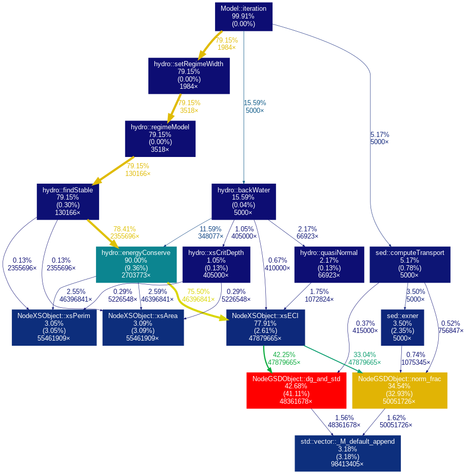

# NeSI Project

## Goals

* improve user interface
* help with setting up repository and code structure
* improve performance if possible


## Repository

Initial setup:

* Pushed "Zip file" version to `master` branch
* Working in `xml-input-model` branch (should do a pull request at some point)


## Input files

Convert input files from custom format to XML (that can be exported from Excel).

* Added `tinyxml2` library for reading in the XML files
* Converted *Input_Rip1_equil_1938.dat*
  - made some assumptions, e.g. `npts = nnodes` (`npts` was not defined in the
    xml file but was in the old dat input file) - **needs to be checked**
  - made up xml structure for stratigraphy - **needs to be checked**
* Converted *hydro_series.dat* and *sed_series.dat*
  - made some assumptions about the XML structure here - **needs to be checked**


## CMake build

Some benefits of CMake:

* better option handling (headless vs GUI builds)
* automatically finding dependencies
* automates running tests and checking results
* works well with Qt

To build with CMake:

```
# create build directory (can be called something else) and change to it
mkdir build && cd build

# configure
#  -DBUILD_GUI=ON is the default
#  -DBUILD_CLI=OFF is default (headless version)
cmake .. -DBUILD_CLI=ON

# compile (using 4 cores)
make -j4
```

To run the tests:

```
ctest --output-on-failure
```


## Separate Model and GUI code

To be able to have a headless/command line interface version, the GUI and model
parts in *mainwindow.cpp* were separated. The model parts were put into a new
class in *model.cpp*. This will enable runs on NeSI, such as parameter sweeps,
where no GUI libraries are needed.


## Headless / CLI version

A headless version was added to the CMake build. To enable it (it is OFF by
default), use the additional configuration option:

```
cmake -DBUILD_CLI=ON ..
```

There was still a dependency on Qt due to the use of `QDateTime`. This was removed
by adding a custom date/time object in *gratetime.cpp*.

The headless version now builds without any dependency on Qt.

### Headless vs GUI performance

Comparing headless vs GUI versions, running for 10,000 timesteps:

- GUI version: 120.81 seconds
- CLI version:  78.14 seconds

The headless version gives a 1.5x speedup over the GUI version (35% reduction
in run time).


## Testing

* using `ctest` to make it easier to run tests
* added one main test that runs for 800 time steps and compares the output to
  a reference version
* added some custom code for comparing against a reference file with some
  tolerance


## Continuous integration

* automatically builds the code and runs tests when pushing changes to the repository
* notifies you if the build or any tests fail

See [my fork](https://github.com/chrisdjscott/GRATE/branches) for example. The green tick
means that branch has passed tests.

Details about the build can be found on the [Travis CI](https://travis-ci.com/chrisdjscott/GRATE/builds/94130621)
website.

There is some one-time configuration that needs to be done to use Travis with
the main repository. Follow steps 1-3
[here](https://docs.travis-ci.com/user/tutorial/#to-get-started-with-travis-ci).


## Profiling headless version



* `NodeGSDObject::dg_and_std` and `NodeGSDObject::norm_frac` have the most self-time
* In `hydro`: `regimeModel`, `findStable` and `energyConserve` have lots of time under them


## Optimisation in `dg_and_std` and `norm_frac`

A [small change](https://github.com/chrisdjscott/GRATE/commit/98b342caf8a8089d8b651ab27eabd8226ce0a466)
to use statically allocated arrays, instead of `std::vector` results in around 15-20% reduction
in run times (depending on compiler).

The change was from:

```cpp
vector<float> ktot;
ktot.resize(psi.size());
```

to:

```cpp
float ktot[ngsz];
```

There is a (small) overhead to creating a `vector` and resizing it. Since these function get
called a large number of times, making this change resulted in a reasonable performance improvement.

Also, the `ktot` array values were being calculated twice and the second calculation was removed
(i.e. values from the first calculation were reused) as part of this change too.


## Merging changes (TODO)

Merging in the changes Jon has made to the GUI:

* get those changes into github
* try to use the merge feature from git/github


## Looking into optimisation routines (TODO)

Optimisation routines such as `regimeModel`, `findStable`:

* Look into using Brent's method instead of bisection
